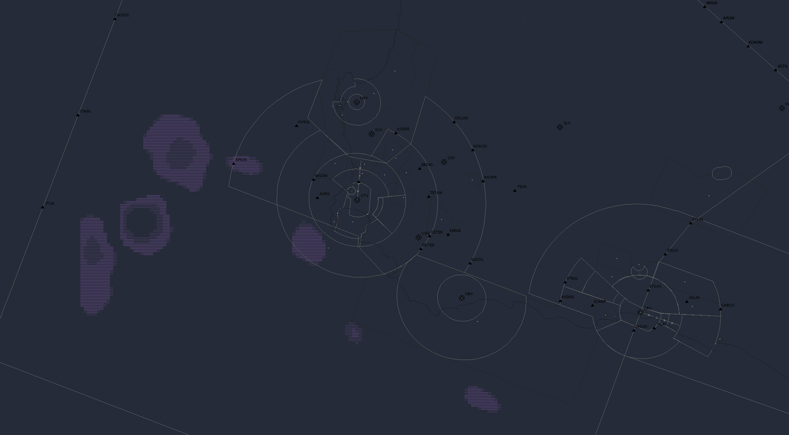

# TopSky weather radar bridge
[](https://github.com/your-username/readback)
[](https://www.python.org/)
[](LICENSE)

A FastAPI-based server that mimics the RainViewer API, allowing the TopSky plugin in EuroScope to display real-time weather radar data using OpenWeatherMap (OWM) as the backend.

---

## Features

- **RainViewer-compatible API**: Seamlessly integrates with TopSky/EuroScope and other clients expecting the RainViewer API.
- **Real Precipitation Data**: Fetches and serves live radar tiles from OpenWeatherMap.
- **High-Resolution Tile Stitching**: Creates composite tiles by combining multiple OWM tiles for enhanced detail and custom resolutions.
- **Multiple Endpoints**: Supports both standard RainViewer and TopSky/EuroScope-specific tile formats.
- **Asynchronous Performance**: Concurrent tile fetching for improved response times.
- **PNG Compatibility**: Returns valid PNG tiles with configurable dimensions for maximum plugin compatibility.
- **CORS & Error Handling**: Handles CORS, logs requests, and returns blank tiles for errors or unknown routes.
- **Configurable**: Easily configure API keys, base URL, and tile layer via environment variables.

---

## How It Works

This server acts as a drop-in replacement for the RainViewer API. When the TopSky plugin requests weather radar tiles, the server:

1. **Receives the tile request** (including non-standard TopSky/EuroScope routes with lat/lon).
2. **Determines tile strategy**: For high-resolution requests, calculates multiple source tiles needed for stitching.
3. **Fetches radar data** asynchronously from OpenWeatherMap using concurrent requests for optimal performance.
4. **Creates composite tiles** by stitching multiple OWM tiles together for enhanced resolution and custom dimensions.
5. **Processes the image** to ensure maximum compatibility (RGBA, configurable dimensions, optimized PNG format).
6. **Returns the PNG tile** to the client. If OWM returns errors or areas are out of range, blank tiles are returned.
7. **Serves a RainViewer-compatible weather-maps.json** for time navigation.

---

## For End Users (Pre-built Executable)

### Download and Install

1. **Download** the latest release from the [Releases page](https://github.com/jonohanekom/topsky-wxr-radar-bridge/releases)
2. **Extract** the ZIP file to any folder on your computer
3. **Get a free API key** from [OpenWeatherMap](https://openweathermap.org/api)
4. **Edit** `config.ini` and replace `YOUR_API_KEY_HERE` with your actual API key
5. **Run** `topsky-wxr-bridge.exe`

### TopSky Configuration

Add these lines to your `TopSkySettings.txt` file:

```
WXR_Server=http://localhost:8000
WXR_TimeStampsURL=http://localhost:8000/public/weather-maps.json
WXR_Page_Prefix=/v2/radar/
WXR_Page_Suffix=.png
WXR_ImageSize=512
WXR_Zoom=4
```

### Requirements

- Windows 10/11
- OpenWeatherMap API key (free)
- TopSky plugin for EuroScope
- Internet connection

For detailed installation instructions, see `INSTALL.md` included in the release package.

---

## For Developers (Source Code)

### Development Quickstart

#### 1. Clone the Repository
```sh
git clone https://github.com/jonohanekom/topsky-wxr-radar-bridge.git
cd topsky-wxr-radar-bridge
```

#### 2. Install Dependencies
This project uses [uvicorn](https://www.uvicorn.org/), [FastAPI](https://fastapi.tiangolo.com/), [httpx](https://www.python-httpx.org/), and [Pillow](https://python-pillow.org/).

Install [uv](https://github.com/astral-sh/uv) if you don't have it:
```sh
pip install uv
```

Then install dependencies:
```sh
uv pip install -r pyproject.toml
```

#### 3. Set Up Environment Variables
Create a `.env` file or set these variables in your shell:

```
OPENWEATHER_API_KEY=your_owm_api_key
BASE_URL=http://localhost:8000
TILE_LAYER=precipitation_new  # or clouds_new, temp_new, etc.
```
#### 4. Configure TopSky
Place the following in your `TopSkySettings.txt` file. Then configure the bounds of your coordinates

```
WXR_Server=http://localhost:8000
WXR_TimeStampsURL=http://localhost:8000/public/weather-maps.json
WXR_Page_Prefix=/v2/radar/
WXR_Page_Suffix=.png
WXR_Zoom=4
```

#### 5. Run the Server
```sh
python main.py
```

The server will be available at [http://localhost:8000](http://localhost:8000).

---

## Configuration

- **OPENWEATHER_API_KEY**: Your OpenWeatherMap API key (required).
- **BASE_URL**: The base URL for the API (default: `http://localhost:8000`).
- **TILE_LAYER**: The OWM tile layer to use. Options include:
  - `precipitation_new` (default)
  - `clouds_new`
  - `temp_new`
  - `wind_new`
  - `pressure_new`
  - `humidity_new`

You can set these in a `.env` file or as environment variables.

---

## Endpoints

- `/public/weather-maps.json` — RainViewer-compatible metadata for radar/satellite layers
- `/v2/radar/{timestamp}/{z}/{x}/{y}.png` — Standard RainViewer radar tile
- `/v2/radar/{timestamp}/{size}/{zoom}/{lat}/{lon}/.png` — TopSky/EuroScope high-resolution stitched tile
- `/v2/satellite/...` — Returns blank tiles (satellite not implemented)
- `/health` — Health check

---

## For TopSky/EuroScope Users

- Set your WXR server to `http://localhost:8000` (or your server's address)
- Configure your plugin's image size and zoom settings (supports custom dimensions via stitching)
- The server automatically creates high-resolution composite tiles by stitching multiple OWM tiles
- Zoom levels are automatically adjusted (+1) to fetch higher resolution source data for better detail

---

## Troubleshooting

- **Blank radar tiles?**
  - Check if there is precipitation in your area on [OpenWeatherMap](https://openweathermap.org/weathermap).
  - Ensure your API key is valid and has tile access.
  - Check the server logs for errors.
- **400 Bad Request from OWM?**
  - This usually means the tile coordinates are out of range for the zoom level. The server now auto-corrects this for TopSky.
- **Want higher resolution?**
  - The server now automatically creates high-resolution tiles by stitching multiple source tiles together.
  - Configure custom tile dimensions in your TopSky settings for optimal display quality.
  - Higher zoom levels provide more detail while maintaining coverage area through tile stitching.

---

## License

MIT License. See [LICENSE](LICENSE) for details.

---

## Credits

- Inspired by the RainViewer API and the EuroScope TopSky plugin.
- Uses FastAPI, Pillow, and httpx.
- Weather data provided by [OpenWeatherMap](https://openweathermap.org/).
